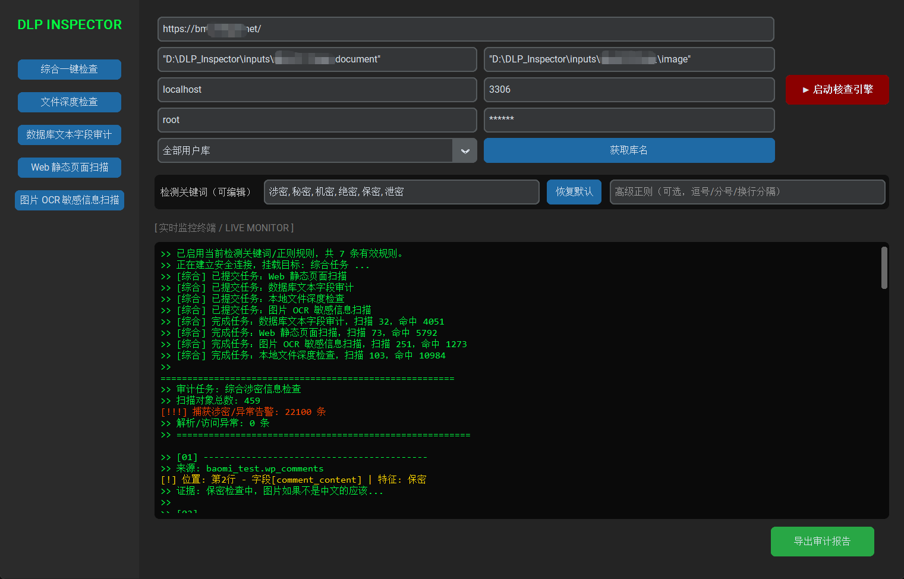
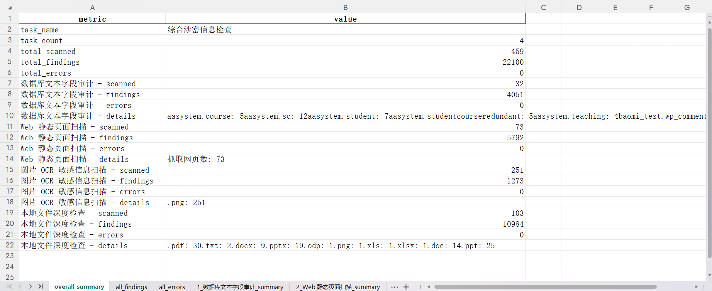

# DLP Inspector

> Lightweight confidentiality audit and sensitive-information inspection prototype

DLP Inspector 是一个轻量级保密审计自查工具原型，用于在授权环境下对本地文件、MySQL / MariaDB 文本字段、Web 静态页面和图片 OCR 文本进行敏感信息检查，并将命中结果归档为可复核的 Excel 明细报告和 HTML 摘要报告。

本项目不是企业级实时阻断 DLP 网关，不提供内核级拦截、网络流量监控、外发阻断、策略下发或终端管控能力；也不是数据库漏洞扫描器、动态 JavaScript 爬虫平台或 OCR 模型训练项目。它的目标是支持文档共享、内部检查或审计归档前的轻量级预检查，帮助用户定位“风险线索在哪里、是否形成了可复核记录”。

## 功能范围

### 综合一键检查

- 支持在 GUI 中一次配置 Web、数据库、文件和图片四类任务。
- 支持同时提交多类检查任务，并生成一套综合审计报告。
- 综合 Excel 报告包含总体概览、高风险摘要、全部命中明细、全部异常明细，以及各子任务 summary；HTML 报告提供离线摘要阅读视图。

### 本地文件敏感信息扫描

- 支持 `.txt`、`.docx`、`.xlsx`、`.pptx`、`.pdf` 以及部分旧版 Office 格式的文本提取与敏感词检测。
- 通过文件真实类型识别降低后缀伪装造成的漏检风险。
- 在 Windows 环境下识别隐藏文件属性，并对隐藏文件给出审计告警。
- 支持对加密 PDF、加密 docx / xlsx / pptx 等文件进行密码输入后继续扫描；旧版 doc / ppt 通过 Windows COM 尽力支持，失败时进入异常留痕。
- 文件扫描会先收集任务目录中的文件列表，再对普通文件进行并发扫描；旧版 Office COM 文件保守串行处理，以降低兼容性风险。

### 数据库文本字段敏感内容审计

- 支持使用标准凭证连接 MySQL / MariaDB。
- 支持自动获取用户数据库列表，可选择单个数据库，也可选择全部用户库。
- 遍历目标库内数据表，并提取文本类型字段进行敏感内容审计。
- 记录命中特征、库名、表名、字段名、行位置和上下文片段。
- 数据库文本字段采用分批读取，避免一次性加载大表。
- 不执行弱口令、注入、越权、配置缺陷等数据库漏洞检测。

### Web 静态页面扫描

- 基于 `requests` 和 `BeautifulSoup` 抓取与解析静态 HTML。
- 使用同域 BFS 遍历策略，并通过最大深度限制控制扫描范围。
- 提取页面可见文本并进行敏感词匹配。
- 不渲染 JavaScript，不执行浏览器自动化，也不承诺覆盖前端动态加载内容。

### 图片 OCR 敏感信息扫描

- 依赖 `PaddleOCR` 提取图片文本，当前实现默认使用 CPU 推理。
- 支持 `.png`、`.jpg`、`.jpeg`、`.bmp`、`.tiff` 等常见图片格式。
- 对 OCR 结果进行置信度过滤后再做敏感词匹配。
- OCR 效果受图片质量、字体、排版、模型文件和运行环境影响；本项目不包含自研 OCR 模型。

### GUI 与报告归档

- 基于 `CustomTkinter` 提供桌面 GUI。
- 支持综合一键检查，也保留文件、数据库、Web、图片四类单项检查入口。
- 支持在 GUI 中编辑本次检测关键词，默认包含：涉密、秘密、机密、绝密、保密、泄密。
- 支持高级正则规则输入，用于识别密级格式或特殊字符间隔的敏感表达。
- 扫描任务运行在后台线程中，避免 I/O 密集型任务阻塞界面。
- 支持导出单项报告和综合报告，便于人工复核和归档。

### 规则配置化

- 默认敏感规则存放在 `config/rules.json`。
- 规则字段包括 `rule_id`、`name`、`pattern`、`type`、`risk_level`、`description`。
- 支持 `keyword` 和 `regex` 两类规则。
- GUI 中的检测关键词和高级正则会在运行期编译为本次扫描规则，不要求普通用户直接修改 JSON 文件。
- 扫描结果会保留命中的规则 ID、规则名称和风险等级。

## 技术栈

- **语言**：Python 3.10+
- **GUI**：CustomTkinter
- **文件解析**：python-docx、python-pptx、openpyxl、xlrd、PyMuPDF、pywin32、olefile、python-magic-bin、msoffcrypto-tool
- **数据库连接**：PyMySQL
- **Web 静态页面解析**：requests、BeautifulSoup
- **OCR**：PaddleOCR / PaddlePaddle，默认 CPU 推理
- **报告导出**：Pandas / OpenPyXL
- **打包工具**：PyInstaller

## 目录结构

```text
DLP_Inspector/
├── assets/              # README 截图素材
├── .github/workflows/   # 不安装重型 OCR 依赖的轻量 CI
├── config/              # 默认规则配置，例如 rules.json
├── core/                # 文件、数据库、Web、OCR 扫描模块
├── docs/                # 交付边界与打包说明
├── models/              # ScanResult / ScanSummary 数据模型
├── report/              # Excel 明细报告和 HTML 摘要报告导出模块
├── sample_data/         # 可复现实验样例
├── scripts/             # 本地验证脚本
├── tests/               # 轻量测试与可选集成测试
├── ui/                  # CustomTkinter GUI
├── utils/               # 文件类型、文档解析、正则匹配工具
├── main.py              # 兼容启动入口
├── run.py               # 推荐启动入口
├── requirements.txt     # 默认 CPU 运行依赖
├── requirements-base.txt # 不含 PaddleOCR / PaddlePaddle
├── requirements-ocr.txt  # CPU/GPU 共用 OCR 前端
├── requirements-gpu.txt  # GPU OCR 运行依赖
├── requirements-test.txt # GitHub Actions 轻量测试依赖
└── README.md
```

`dist/`、`build/`、`__pycache__/`、`audit_reports/`、`inputs/` 属于本地构建、运行产物或课程测试数据，不应作为源码仓库内容提交。

## 安装与运行

建议使用 Python 3.10 或 3.11 创建虚拟环境。OCR 与部分科学计算依赖在过新的 Python 版本上可能存在兼容性问题。

```powershell
python -m venv .venv
.\.venv\Scripts\Activate.ps1
pip install -r requirements.txt
python run.py
```

如只运行文件、数据库、Web、报告及 GUI 的非 OCR 入口，可安装：

```powershell
pip install -r requirements-base.txt
```

`requirements-base.txt` 不包含 PaddleOCR / PaddlePaddle。OCR 模块采用延迟导入，因此缺少 OCR 依赖时不影响其他核心模块导入；实际执行图片 OCR 前仍需安装 `requirements.txt`，或单独安装 `requirements-ocr.txt` 和匹配的 PaddlePaddle CPU/GPU 运行时。

## 报告输出

报告由 `report/report_manager.py` 生成，默认输出到本地 `audit_reports/` 目录。Excel 保留完整审计证据，HTML 提供便于快速阅读的摘要视图。

单项 Excel 报告包含：

- **summary**：任务名称、扫描对象数量、命中数量、异常数量、类型分布。
- **high_risk_findings**：critical / high、隐藏文件、后缀伪装、加密文档和解析/访问异常等高风险摘要。
- **findings**：来源类型、路径/URL/表名、位置、规则 ID、规则名称、风险等级、命中特征、上下文证据。
- **errors**：解析失败、权限异常、依赖缺失等需要人工复核的问题。

综合 Excel 报告包含：

- **overall_summary**：综合任务数量、总扫描对象数、总命中数、总异常数。
- **high_risk_findings**：跨任务高风险摘要，便于优先复核。
- **all_findings**：所有子任务的命中明细。
- **all_errors**：所有子任务的异常明细。
- **子任务 summary**：各扫描模块的独立统计信息。

HTML 摘要报告包含总览统计、分模块统计、风险等级分布、Top 规则命中、高风险明细 Top 100 和异常摘要 Top 100；完整明细仍以同目录 Excel 文件为准。

## 可复现实验

仓库提供了小型样例数据和本地验证脚本，用于验证文件扫描、规则命中和报告导出闭环：

```bash
python scripts/smoke_scan.py
```

默认扫描 `sample_data/files/` 并导出 Excel 明细报告和 HTML 摘要报告到本地 `audit_reports/` 目录。

## 自动化测试

仓库提供轻量自动化测试与 GitHub Actions，不要求 CI 安装 PaddleOCR、PaddlePaddle、连接真实 MySQL 或准备 Windows Office COM 环境：

```bash
pip install -r requirements-test.txt
python -B -m pytest -q
python -B scripts/smoke_scan.py --no-report
```

测试覆盖规则加载与模糊正则、文件 smoke、Web 同域 BFS、数据库分页 mock、异常路径、Excel sheet/字段结构，以及 HTML 摘要报告关键区块。OCR、真实 MySQL 和 Windows COM 保留为默认跳过的可选集成测试。详细说明见 [docs/testing.md](docs/testing.md)。

## 打包说明

PyInstaller 打包涉及 PaddleOCR、PaddlePaddle、OpenCV、CustomTkinter 等较重依赖，容易受到 Python 版本、CPU/GPU 包选择和模型缓存位置影响。详细说明见 [docs/packaging.md](docs/packaging.md)。

当前源码仓库不随附可执行文件。如需独立运行版本，应先在目标环境完成打包，并验证生成的 `dist/` 目录后再交付。

## 界面预览

### 综合一键检查



### 本地文件敏感信息扫描


### 数据库文本字段敏感内容审计


### Web 静态页面扫描


### 图片 OCR 敏感信息扫描


### 综合审计报告导出



## 已知限制

本项目以规则匹配和 OCR 文本提取为主，适合作为轻量级保密审计自查与小规模功能验证原型。关于误报/漏报、Web 静态扫描边界、数据库审计边界、OCR 环境依赖和 Office 解析限制，见 [docs/limitations.md](docs/limitations.md)。

## 合规声明

1. 本工具仅限于对已获得合法授权的资产进行安全审查、合规自查和功能验证。
2. 严禁将本工具用于未经授权的数据访问、渗透测试、数据窃取或任何违反法律法规的数据处理行为。
3. 软件运行产生的合规责任由具体使用者承担。
