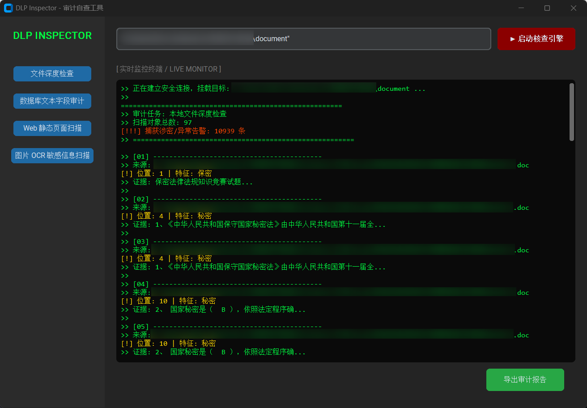
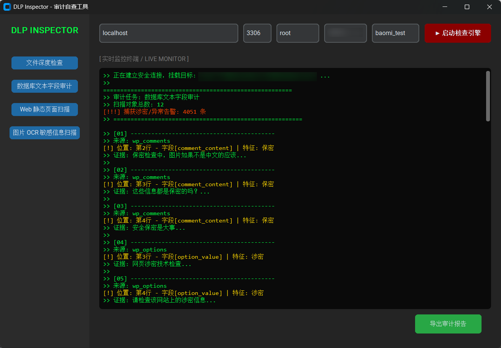
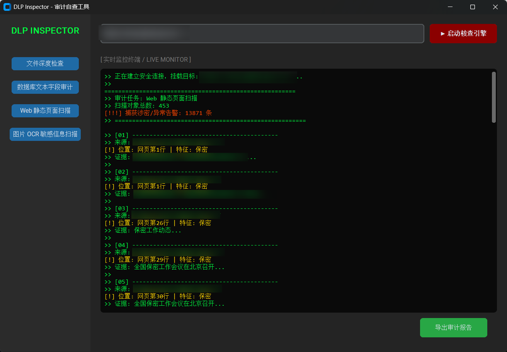
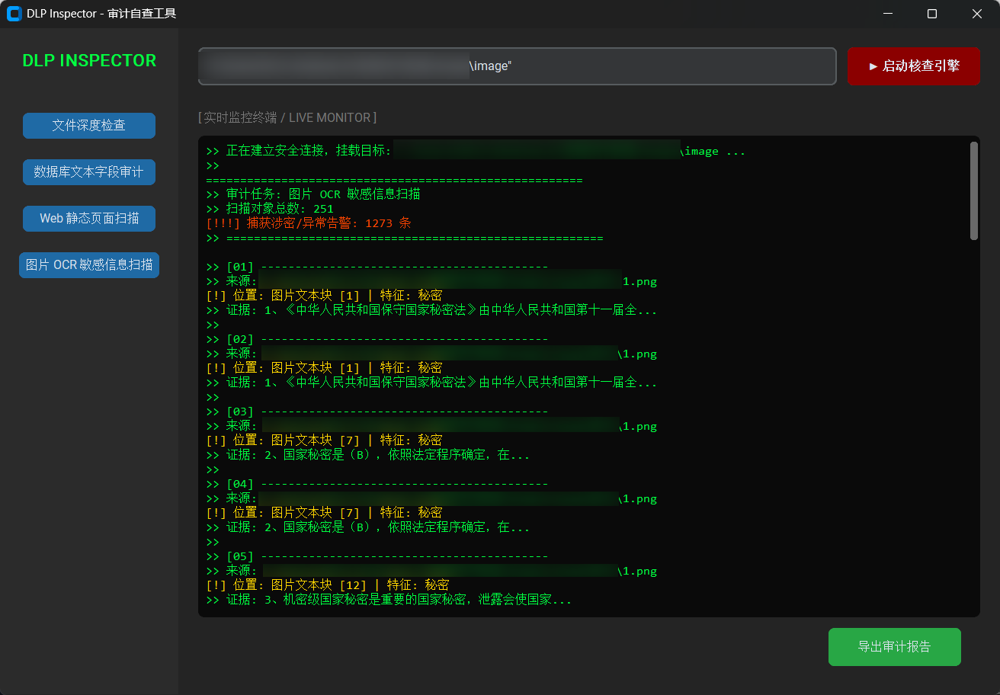
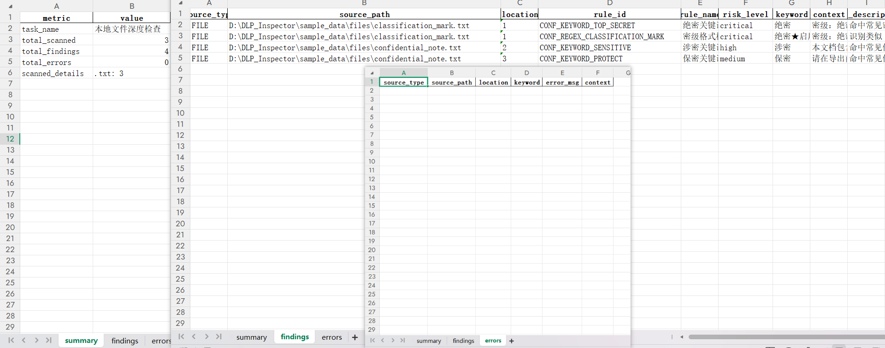

# 数据防泄漏（DLP）安全审计终端

> **Data Loss Prevention Audit Terminal**

本项目是一款面向多源数据的敏感信息审计工具，旨在辅助安全管理员、合规审查人员或开发者，对本地文件系统、关系型数据库、Web 页面和图像介质中的潜在敏感信息进行自动化扫描、定位与报告归档。

系统采用规则匹配、文档解析、网页爬取与 OCR 识别相结合的方式，支持对命中文本、上下文片段、风险源路径与扫描概况进行结构化汇总，并导出 Excel 审计报告。

---

## 界面预览

### 本地文件深度检查



### 数据库穿透扫描



### 网页动态爬虫



### AI 图像涉密识别



### 审计报告导出



---

## 核心功能模块

系统底层采用模块化设计，集成四类审查引擎：

### 1. 本地文件深度检查（Local File Scanner）

- **多格式解析**：支持 `.txt`、`.docx`、`.xlsx`、`.pptx`、`.pdf` 以及部分旧版 Office 格式的文本提取与敏感词检测。
- **真实类型识别**：结合文件扩展名与类型探测逻辑，降低后缀伪装导致的漏检风险。
- **隐藏属性检测**：在 Windows 环境下通过系统 API 识别隐藏文件及特殊权限文件。
- **加密状态识别**：对密码保护或权限受限文档进行异常捕获与告警记录，避免审计过程静默遗漏。

### 2. 数据库安全扫描（Database Scanner）

- **文本字段审计**：支持基于标准凭证连接 MySQL，遍历库内表结构并提取文本字段进行敏感信息检测。
- **逐行扫描**：对文本字段内容进行逐行匹配，记录命中特征、所在表名、字段名与上下文。
- **异常管理**：支持数据库连接异常捕获与扫描错误提示，提升大批量数据检索时的可诊断性。

### 3. 网页动态爬虫（Web Scanner）

- **同域 BFS 扫描**：采用可控深度的广度优先遍历策略，默认深度为 2，对目标站点进行页面抓取与敏感词检测。
- **正文解析**：基于 `requests` 与 `BeautifulSoup` 提取页面文本内容。
- **URL 去重与循环控制**：维护已访问 URL 集合，避免重复爬取与页面环路导致的扫描膨胀。

### 4. 图像 OCR 识别（Image OCR Scanner）

- **图像文本识别**：集成 `PaddleOCR`，支持常见图片格式中的文本提取与敏感词检测。
- **置信度过滤**：对 OCR 结果进行置信度筛选，降低低质量识别文本带来的误报。
- **多环境兼容**：普通运行与打包版本默认采用 CPU 推理，开发环境可按需安装 GPU 依赖以提升 OCR 推理速度。

---

## 系统架构与技术栈

本项目采用分层模块化架构，将扫描引擎、数据模型、GUI 展示与报告导出解耦，便于后续扩展新的数据源、识别规则和报告格式。

- **编程语言**：Python 3.10+
- **前端展现**：基于 `CustomTkinter` 构建桌面 GUI，支持扫描模式切换、实时日志展示与报告导出
- **数据处理**：`Pandas` / `OpenPyXL`，用于结果聚合与 Excel 报告生成
- **文档解析**：`python-docx`、`python-pptx`、`PyMuPDF`、`xlrd` 等
- **网页解析**：`requests` / `BeautifulSoup`
- **视觉识别**：`PaddleOCR` / `PaddlePaddle`，默认 CPU 推理，开发环境可选 GPU 依赖
- **并发控制**：基于 `threading` 的后台扫描线程，避免 I/O 密集型任务阻塞 UI 渲染
- **编译部署**：`PyInstaller`，用于生成独立可执行程序

---

## 项目结构

```text
DLP_INSPECTOR/
├── core/                  # 核心扫描引擎
│   ├── file_scanner.py    # 本地文件扫描与多格式解析
│   ├── db_scanner.py      # MySQL 数据库文本字段扫描
│   ├── web_scanner.py     # 同域 BFS 网页爬虫
│   └── image_scanner.py   # OCR 图像文本识别
├── models/                # 数据模型层
│   └── data_models.py     # ScanResult / ScanSummary 统一结果模型
├── ui/                    # GUI 表现层
│   └── main_window.py     # 主窗口、模式切换、日志展示与任务调度
├── report/                # 报告导出层
│   └── report_manager.py  # Excel 审计报告生成器
├── utils/                 # 公共工具函数
│   └── regex_utils.py     # 敏感词正则构建与匹配工具
├── config/                # 配置与敏感词规则
├── assets/                # 项目截图与展示素材
│   ├── ui_file_scan.png
│   ├── ui_db_scan.png
│   ├── ui_web_scan.png
│   ├── ui_image_scan.png
│   └── report_preview.png
├── dist/                  # PyInstaller 打包输出目录，本地构建生成
├── run.py                 # 项目启动入口
├── requirements.txt       # 默认 CPU 运行依赖
├── requirements-base.txt  # 通用依赖
├── requirements-gpu.txt   # GPU 开发环境依赖
└── README.md
```

---

## 部署与使用

### 选项 A：开箱即用（独立部署方案）

对于无 Python 环境的终端设备，可使用 PyInstaller 打包后的独立可执行程序。

1. 获取编译后的目录并进入 `dist/` 下对应程序目录。
2. 双击运行主程序，例如 `DLP_DeepWatcher.exe`。
3. 在左侧导航栏选择对应审计模式。
4. 输入目标路径、数据库连接参数、入口 URL 或图片路径。
5. 点击“启动检查引擎”，等待扫描完成。
6. 通过界面按钮导出结构化 Excel 审计报告。

### 选项 B：基于源码运行（二次开发方案）

克隆项目并进入根目录：

    git clone https://github.com/Zephyr-edu-cn/DLP_Inspector.git
    cd DLP_Inspector

创建并激活虚拟环境后，安装默认 CPU 依赖：

    pip install -r requirements.txt

运行程序：

    python run.py

---

## OCR 运行环境

项目默认使用 CPU 版 PaddleOCR 依赖，便于打包部署并降低 CUDA / GPU 驱动环境要求。当前 `core/image_scanner.py` 中 `use_gpu=False`，与默认依赖保持一致。

普通安装或打包部署：

    pip install -r requirements.txt

具备 CUDA 环境的开发机可安装 GPU 版本依赖：

    pip install -r requirements-gpu.txt

GPU 版本需要匹配的 CUDA / cuDNN / 显卡驱动环境；若仅使用打包版或普通本地运行，使用默认 `requirements.txt` 即可。

---

## 审计报告输出

系统采用统一的 `ScanSummary` 数据模型进行结果聚合，导出的 Excel 报告通常包含两个工作表：

- **Dashboard / 检查概述**：记录扫描任务名称、扫描范围、耗时、扫描对象数量、命中数量等宏观统计信息。
- **Details / 涉密明细清单**：记录风险源路径、命中特征词、命中位置、上下文片段和扫描来源，便于后续人工复核与合规追踪。

报告导出流程由 `report/report_manager.py` 负责，底层基于 `Pandas` 与 `OpenPyXL` 实现。

---

## 设计特点

### 多源解析统一抽象

文件、数据库、网页和图像 OCR 的扫描结果统一收敛到 `ScanResult` / `ScanSummary` 数据模型中，便于 GUI 展示、日志记录和报告导出。

### 规则匹配可扩展

敏感词检测当前以规则匹配为主，结合模糊正则构建机制，对关键词中间插入空格、符号或下划线的情况具有一定鲁棒性。

### GUI 与扫描任务解耦

扫描过程运行在后台线程中，避免大文件解析、数据库扫描、网页爬取或 OCR 推理阻塞主界面。

### 工程化审计闭环

系统形成了从“输入源选择 → 扫描执行 → 实时日志 → 风险汇总 → Excel 报告导出”的完整流程，适合作为轻量级 DLP 审计工具原型。

---

## 已知限制与后续优化

当前系统以规则匹配为主，适合已知敏感词、密级标识和固定风险特征的审计场景。后续可继续扩展：

- 可配置规则库与敏感词分级策略
- 正则、关键词、实体识别混合检测
- 风险等级评分与误报统计机制
- 数据库流式扫描与分页读取
- Web 扫描的 robots / 限速 / 域名白名单策略
- OCR 推理的 CPU/GPU 动态切换
- 更完整的样例数据集与测试报告

---

## 声明与合规性

1. 本工具仅限于对已获得合法授权的资产进行安全审查与合规性自测。
2. 严禁将本工具用于未经授权的渗透测试、数据窃取或任何违反相关法律法规的数据处理行为。
3. 软件运行产生的合规性责任由具体使用者承担。

---

*Generated for DLP Inspector - Data Security Auditing Project.*
